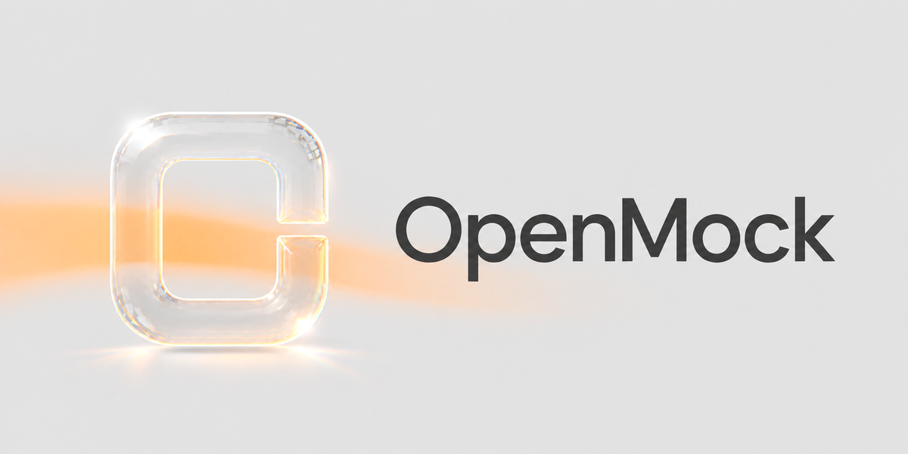
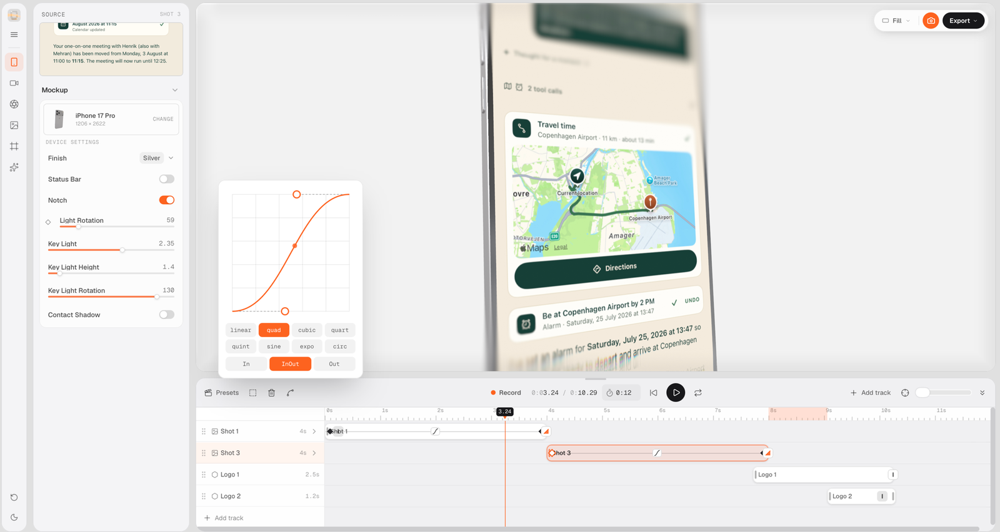

<p align="center">
  
</p>

Put your screenshots on 3D devices and turn them into promo videos, right in the browser.

OpenMock places a screenshot or screen recording on a 3D device, lets you frame it with a camera, add depth of field and other effects, animate everything on a keyframe timeline, and export an image or a video. It all runs client side. No account, no server, no uploads.

Images export free at full quality with no watermark. Free video exports go up to 720p 30 fps and carry a small watermark. Pro is $5 a month or $36 a year, removes the watermark, unlocks 1080p, 4K and 60 fps, and adds portable project files you can save, reopen and share. The source is open, so you can also build the unlocked version yourself. That is allowed and genuinely fine. Paying is the convenient way that keeps the project maintained.



## Features

- 3D device mockups with studio HDRI lighting. Drag to rotate, scroll to zoom.
- Device library: iPhone 17 (5 finishes), iPhone 17 Pro and Pro Max, iPad Pro, Apple Watch Ultra, MacBook Neo, MacBook Pro 14" and 16", Pro Display XDR, plus a frameless flat panel for plain screenshots.
- Depth of field with radial, directional and tilt-shift modes. Focus point, falloff and band controls.
- Effects: bloom, film grain, vignette, chromatic aberration, sharpen, pixel grid.
- Backgrounds: gradient presets, solid colors, your own images, or transparent.
- Timeline with multiple tracks, keyframes with bezier easing, camera move recording, camera presets, and text and logo shots that can overlay other tracks.
- Export PNG, JPG or WEBP up to 4K, and MP4 or WebM video encoded in the browser with WebCodecs. Video export needs Chrome, Edge or Safari 16.4+.

## Getting started

```bash
npm install
npm run dev
```

Then open http://localhost:5173.

## Stack

Vite, React, TypeScript, Three.js, Zustand, Radix UI, Tailwind CSS, WebCodecs with mp4-muxer and webm-muxer.

## License

OpenMock uses the [Functional Source License](LICENSE) (FSL-1.1-MIT). You can use it freely, personally or at work, including for commercial output like client videos and marketing. You can read the code, change it, self host it and contribute. What you cannot do is sell OpenMock itself, or a derivative of it, as a product or service. Each release automatically becomes MIT licensed two years after publication.

## Assets

All device 3D models are procedural and built from scratch in three.js. There are no third party model files in this repo. The HDRIs (`brown_photostudio_04`, `studio_small_08`) and floor textures come from [Poly Haven](https://polyhaven.com) under CC0. Background images, device thumbnails, default screens and guide media were generated with OpenMock itself.

iPhone, iPad, MacBook and Apple Watch are trademarks of Apple Inc. The names are used only to identify the device style being simulated. OpenMock is an independent project and is not affiliated with, endorsed or sponsored by Apple.
